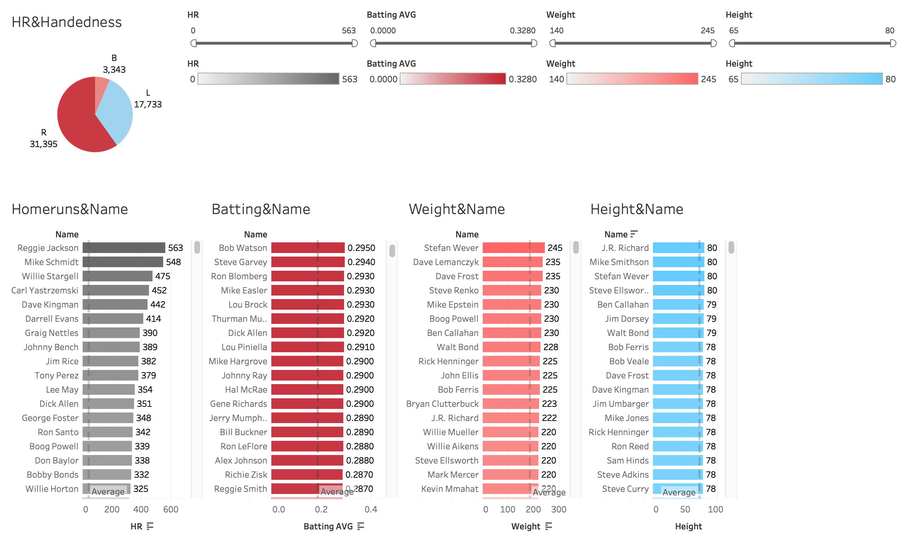
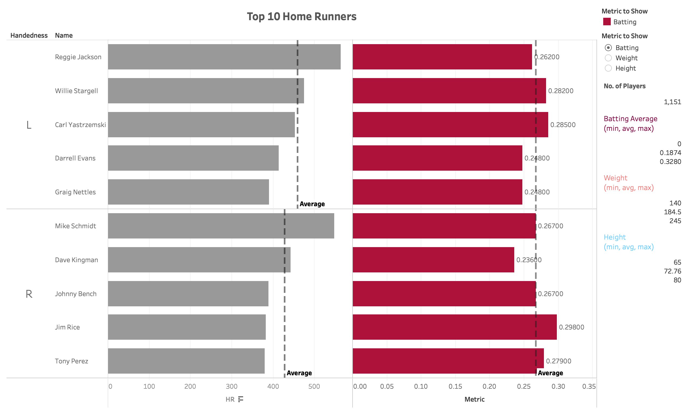
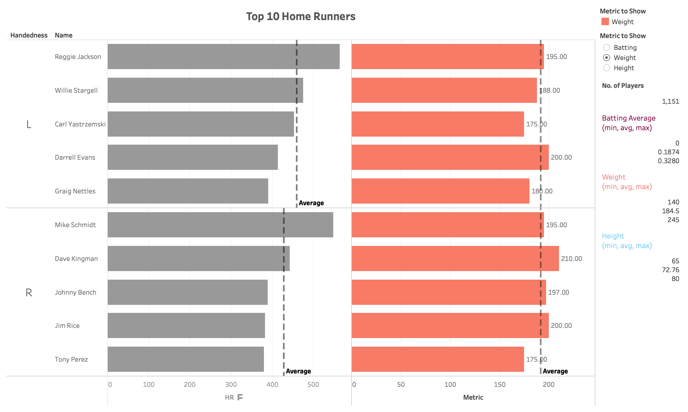
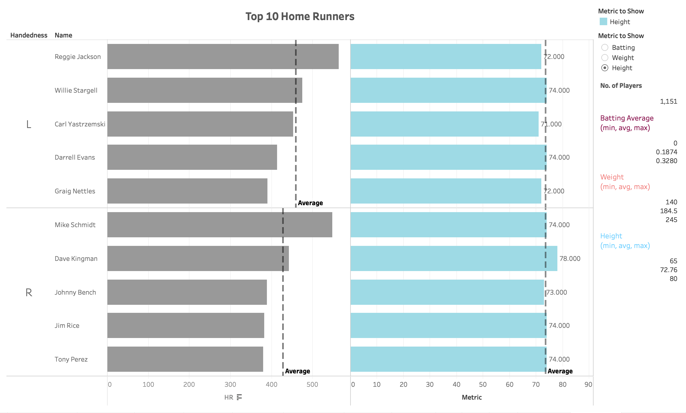
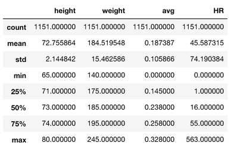

# Baseball Players Performance
## Table of Contents
<ul>
<li><a href="#intro">Introduction</a></li>
<li><a href="#Summary">Summary</a></li>
<li><a href="#Design">Design</a></li>
<li><a href="#Feedback">Feedback</a></li>
<li><a href="#Findings">Findings</a></li>
<li><a href="#Resources">Resources</a></li>
</ul>

## Introduction
This report presents the data visualization steps taken on the baseball players performance data, and communicates the
findings and patterns found. The analysis and visualization was done using Python and Tableau, and a dataset containing 1,151 baseball players.

### Dataset Overview
A baseball dataset containing 1,151 baseball players including their;
* name: first and last name
* handedness: right or left handed
* height: in inches
* weight: in pounds
* avg: batting average
* HR: home runs

## Summary
Different visualization charts were used to communicate insights on the performanc of the baseball players. More specifically, the relationship between the variables handedness, batting average, height, and weight were analyzed to explore their effect on how many home run hits a players gets. This was visualized using bar and pie charts. A chart was created for each dimention/variable.

## Design
The pie chart was chosen to show the distribution of the players based on their handedness. This intatnly can tell us which hand most baseball players in the dataset use. Bar chart was used to show how much pounds each player weighs, and how much inches tall each player is. They were also used to show how the batting average score for each player. Unlike a skatter plot, bars stacked next to each other in a bar chart instantly gives away the top player rather than trying to map each dot in a skatter plot to the metric value trying to find whether or not it is high. Color-coding was used to distinguish between the metrics/dimentions. Labels next to each bar/slice are shown to communicate the exact value. Also, the average for each metric is illustrated by a dashed reference line on each chart.

### Initial Design
  

Tableau Public Workbook: https://public.tableau.com/views/BaseballPlayersDataStory/InitialDesign?:embed=y&:display_count=yes&publish=yes

## Feedback

**Reviewer's Feedback**
* It is difficult to track whether or not the same player exists in the top players for each dimention/variable.
* I suggest that the charts only focus on the top 5 or 10 players. There's no need in this scenario to review all the players.
* Use more meaningful chart titles.
* Using the same colors in the pie chart is confusing since it doesn't consider the dimentions for which these colors are codes for.
* The average lines are not very clear

As a response to the feedback, a new visualization was produced. To help declutter the dashboard, two main changes were made.
   1. This new visualization combines all the charts in one bar chart with interface elements on the right to help the reader interact with the chart, showing different metrics and how they relate/affected the top players home runs.
   2. This chart focuses on the top 10 players with hom run hits only, showing the player's name, handedness, and home runs. Only these dimentions are fixed. The rest of the dimentions weight, height and batting average are dynamically shown when chosen in order to see how each of these metrics relate to high home run hits. In the legend, there are interface elements to help interact with the chart dynamically. Moreover, there's a choice of metric to show as a bullet-point list, and a summary of the home runs dimention and the metric. The metric bars are color-coded based on the metric choice. Hovering over each bar shows the the player's name, handedness, home runs, and the chosen metric; batting average, weight, and height. The average of the top performaing players for each metric is illustrated by the dashed reference line on the chart.
It was found that players with weights around this average scored the most amount of home runs.

### Final Design
* **When choosing the Batting metric:**
  
* **When choosing the Weight metric:**
  
* **When choosing the Height metric:**
  

Tableau Public Workbook: https://public.tableau.com/views/BaseballPlayersPerformance_FinalDesign/FinalDesign?:embed=y&:display_count=yes&publish=yes

## Findings
* The following table shows briefly summarizes the players in the dataset.
  

* Players with weights around average weight of 184 scored the most amount of home runs.
* There is no clear relationship between performance and weight.
* The top 10 performing baseball players happen to be;
    * right handed
    * have a weight between 175 and 210 pounds (average is 191)
    * have a height between 71 and 78 inches (average is 73)
    * have a batting score between 0.236 and 0.298 (average is 0.2672)

## Resources
* http://www.storytellingwithdata.com
* https://policyviz.com/blog/
* https://www.data-to-viz.com/
* https://www.data-to-viz.com/caveats.html
